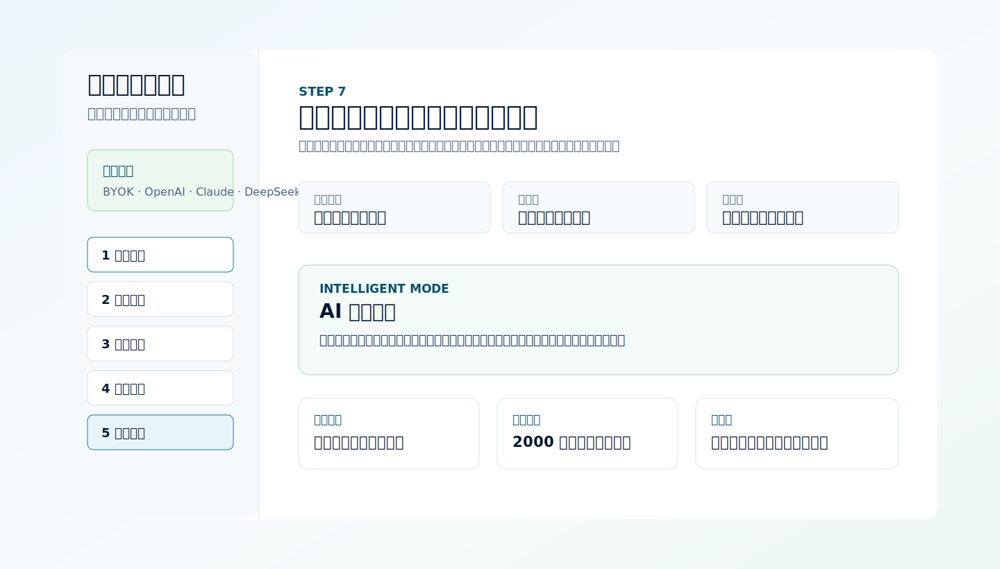

# 研究选题工作台 Thesis Proposal Agent

> 从“我大概想做这个方向”，推进到“我能拿去答辩的开题方案”。

这是一个面向毕业论文、课程论文和开题报告的交互式选题工作台。它把需求采集、学科路由、候选方向筛选、方向深挖、OpenAlex 文献检索、文献缺口矩阵和 AI 开题扩写串成一条完整流程，帮助学生把模糊兴趣收敛成边界清楚、证据链可核验、方法路线能落地的研究题目。

[在线体验](https://zhihuiyuuu.github.io/Thesis-Proposal-Agent/) · React + Vite · OpenAlex · BYOK AI



## 它解决什么问题

- 不只是“生成一个题目”，而是先让用户说明学生层次、学科方向、方法传统、数据条件和导师偏好。
- 不把 AI 当万能答案，而是先用规则引擎守住学科边界，再用文献和缺口矩阵校验选题是否能继续做。
- 不停留在论文摘要或 PDF 列表，而是把文献里的对象、约束、方法、数据、基线和风险转成可改进方向。
- 最终输出可继续修改的开题包、候选文献列表、补文献关键词和答辩问题。

## 核心流程

1. 需求采集：明确学生层次、学科、方法传统、数据条件和导师偏好。
2. 学科路由：把宽泛兴趣转换成更适合当前专业的研究路径。
3. 方向地图：展示可探索的主题分支，避免一上来就锁死题目。
4. 候选筛选：从推荐度、新颖性、可行性、文献基础和数据可得性筛方向。
5. 方向深挖：把方向继续收窄到研究对象、边界、方法路线和风险。
6. 文献检索：用 OpenAlex 检索公开文献元数据，并支持年份筛选和排序。
7. 缺口矩阵：基于已选文献判断问题边界、数据/复现、高威胁区分、基线对比等缺口。
8. 开题包：把选中的缺口方向扩写成开题报告草稿。
9. 下载中心：导出开题包和候选方向文献列表。

## 两种模式

### 默认模式

无需 API Key。使用本地规则引擎、OpenAlex 文献元数据、缺口矩阵和导出工具，打开即可使用。

### 智能模式

在侧边栏 `API 配置` 中填入自己的 Key 后启用。支持 OpenAI / Codex、Claude / Anthropic、DeepSeek、小米 / MiLM、自定义 OpenAI 兼容接口。AI 可用于：

- 方向深挖：根据学生条件把题目继续收窄。
- 文献检索：生成多组英文检索式，而不是只依赖一条关键词。
- 缺口矩阵：读取已选文献，生成更具体的可改进方向、证据链和风险提示。
- 开题包：把最终方向扩写成更完整的开题报告初稿。

## 为什么不是普通模板生成器

- 先问学生条件，再生成方向。
- 先检索文献，再判断缺口。
- 先说明证据链，再写开题草稿。
- 输出内容保留风险、边界和补文献关键词，避免“看起来完整但无法答辩”。

## 适合谁

- 还只有模糊兴趣、需要收窄题目的本科生或研究生。
- 想快速检查选题是否有文献基础和可行性的学生。
- 想把开题报告从“方向描述”推进到“可验证问题”的用户。
- 需要一个可部署、可二次开发的选题工作流原型的开发者。

## 安全说明

API Key 只保存在当前浏览器的 localStorage 中。本项目是静态站点，没有后端代理；公共或共享电脑不要保存真实密钥。仓库不包含任何真实 API Key。

## 本地运行

```bash
npm ci
npm run dev
```

## 验证

```bash
npm test
npm run build
```

## GitHub Pages 部署

当前仓库使用手动 `docs/` 目录部署，避免依赖 GitHub Actions。

```bash
npm run build:pages
```

把生成的 `docs/` 上传到 GitHub 后，在仓库 `Settings -> Pages` 中设置：

- Source: `Deploy from a branch`
- Branch: `main`
- Folder: `/docs`
